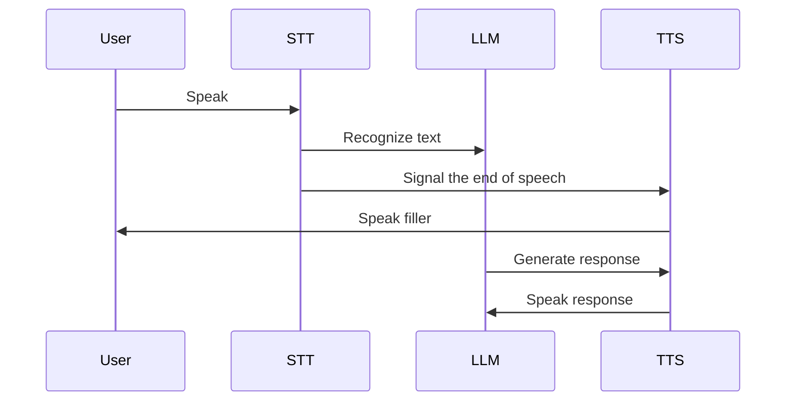

# Spokemon ITMO Project

## Description

This project is a simple implementation of a voice assistant. It uses the following services:



## Features

- [x] Speech-to-text
- [x] Text-to-speech
- [x] Language model
- [x] Iteration history
- [x] Separate process for listening
- [x] Local whisper cpp python
- [ ] Interuption handling
- [ ] Local LLM
- [ ] Local STT
- [ ] RAG

## Installation

#### Clone the repository and install the requirements:

```bash
git clone https://github.com/vktrbr/spokemon-itmo
cd spokemon-itmo
pip install -r requirements.txt
```

#### Install MPV if you don't have it: https://mpv.io/installation/

#### Set up the environment file .env

#### Run the project:

```bash
python main.py
```
